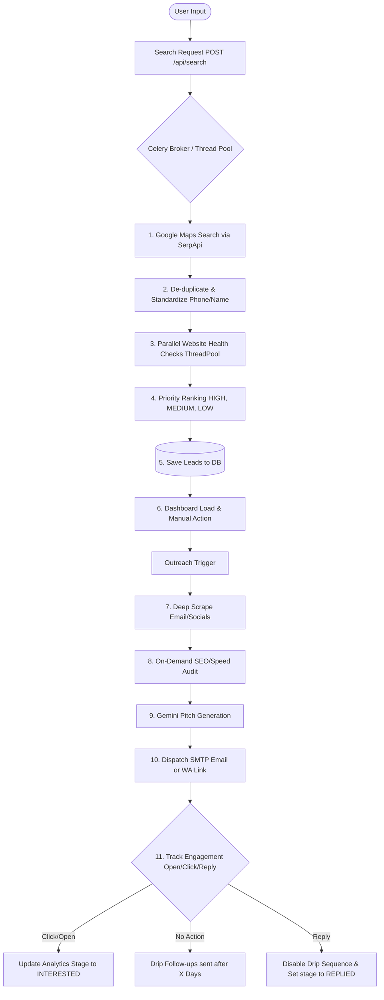

# AI LeadHunter Agent — Comprehensive System Design & Interview Guide

This document provides a production-grade system architecture and design breakdown of the **AI LeadHunter Agent**. It details how the codebase operates under the hood, why specific architectural choices were made, and how to present this system effectively during technical interviews.

---

## 1. System Overview

### What the LeadHunter Agent Does
The AI LeadHunter Agent is an automated lead generation, enrichment, and cold outreach engine. It enables agencies and B2B professionals to discover high-value local business prospects (e.g., gyms, medical clinics, beauty salons, restaurants) who lack a strong digital presence.

Instead of generic web scraping, the agent:
1. **Discovers** businesses via Google Maps.
2. **Filters** out companies with established websites (who are unlikely to buy web development services).
3. **Identifies premium targets**—businesses that have no website or possess a broken/offline site.
4. **Enriches** the lead profiles by crawling their sites, extracting email addresses, and searching social profiles.
5. **Audits** websites for Speed, SEO, Mobile Responsiveness, SSL, and Image Alt properties.
6. **Scores & Prioritizes** prospects using Google review counts and audit metrics.
7. **Drafts Hyper-Personalized pitches** using the Gemini LLM with context-specific domain knowledge.
8. **Automates Outreach & Follow-up** via WhatsApp links, SMTP cold emails, and auto-drip follow-ups.
9. **Tracks Engagement** via 1x1 tracking pixels, link redirects, and inbound IMAP reply synchronization.

### Real-World Use Case
Imagine a digital marketing agency selling premium SEO and web design services.
- **Problem**: Finding local businesses that need help, validating if their sites are down, doing manual SEO audits, writing unique emails, and following up takes hours of manual labor.
- **Solution**: The agency inputs `"Dentist" in "Mumbai"` into LeadHunter. The system discovers 100 dentists. It automatically checks their websites. It identifies 5 dentists with broken sites, 15 with no site, and 10 with terrible SEO scores. It generates a custom-designed mockup layout for each. It writes cold emails referencing their specific SEO scores (e.g., *"Your speed is 40/100, and you are missing a mobile viewport tag"*), logs open/click rates, and automatically sends follow-ups 3 days later unless they reply.

---

## 2. Tech Stack

The architecture is built on a decoupled, production-ready stack:

| Layer | Technology Used | Rationale |
| :--- | :--- | :--- |
| **Frontend UI** | HTML5, JavaScript (ES6+), Vanilla CSS (Flexbox/Grid, Custom CSS Variables) | Premium responsive dashboard. Highly responsive design system utilizing curated HSL palettes, glassmorphism, dynamic progress indicators, and custom modals. |
| **Backend Core** | Python, Flask Web Framework | Lightweight, modular blueprint routing, fast prototyping, and clean integration with Python's ecosystem of scraping and AI packages. |
| **Database** | PostgreSQL, SQLAlchemy ORM, Alembic | Highly structured relational schema, transaction isolation, index-based querying, and connection pooling (using `max_overflow=20` and `pool_pre_ping=True`). |
| **Task Queue** | Celery + Redis (Prod) / Python `threading` (Dev) | Async task worker structure that runs heavy scraping, API calls, and email schedules in the background, keeping request response times under 100ms. |
| **Scraping Engine** | SerpApi (Google Maps & Web Search), `requests` + standard HTML Parser | Utilizes SerpApi for maps pagination. Employs direct crawling with native Python parsers protected by SSRF (Server-Side Request Forgery) filters. |
| **AI Orchestration**| Google Gemini API (stateless REST), YAML prompts | Cascading dynamic prompt architecture featuring hot-reloading YAML templates, structured temperature guidelines, and an automatic model-fallback pipeline. |
| **Email Infrastructure**| Standard Python `smtplib`, `imaplib` | Custom user-level SMTP credential integration for cold outbound delivery; IMAP integrations for real-time inbound reply syncing. |
| **Caching** | Flask-Caching (Redis in Prod, SimpleCache in Dev) | Optimizes performance on telemetry-heavy dashboards, preventing redundant database aggregates. |
| **Rate Limiting** | Flask-Limiter | Prevents brute-forcing and API abuse, using IP/session scopes. |

---

## 3. Step-by-Step System Workflow

The system execution flow is entirely asynchronous, processing leads in distinct pipeline stages:



### Stage 1: Search & Discover
1. User enters keywords, city, and configuration (e.g., target results, deep scanning).
2. The endpoint submits a job to the background queue and returns a `task_id` instantly.
3. The background worker queries SerpApi's `google_maps` engine. If `deep_scan` is enabled, the query is broken into sub-zones (sectors/neighborhoods) to crawl deeper into Google Maps pagination boundaries.

### Stage 2: Clean, Standardize & Dedup
1. **Deduplication**: Filters leads matching existing unique Google `place_id` records, identical phone numbers, or similar names at identical cities.
2. **Phone Standardization**: Uses the `phonenumbers` library to validate numbers and classify line types (`MOBILE` vs `LANDLINE`). Outbound campaigns are limited to mobile numbers.
3. **Website Verification**: Runs parallel `HEAD` / `GET` requests using a `ThreadPoolExecutor`. SSL handshake errors are identified as "live but misconfigured," whereas socket timeouts/DNS failures are marked as `is_broken_website = True`.

### Stage 3: Scoring & Priority Allocation
Priority is determined dynamically:
* **IGNORE**: Businesses with active, healthy websites (not our primary target audience).
* **HIGH**: Businesses with **broken websites** or no websites, valid mobile numbers, and `< 50` reviews (high growth potential, needing immediate digital support).
* **MEDIUM**: Businesses with no/broken websites, valid mobile numbers, and `50 - 200` reviews.
* **LOW**: Businesses with no/broken websites but no valid phone number or `> 200` reviews.

### Stage 4: Enrichment & Auditing
On-demand, the agent runs deeper scans:
1. **Email Crawling**: Connects to the business website, parses homepages, extracts email addresses, filters assets (e.g., `.png`, sentry addresses), and traverses up to 3 child contact pages (e.g., `/contact`, `/about-us`).
2. **Directory Fallback**: If crawling fails, the system executes a Google Search query: `"{business_name}" "{city}" email` using SerpApi, parsing snippets for valid emails.
3. **SEO Auditing**: Downloads homepage HTML and measures page load performance. An HTML parser counts image alt tags, verifies page title/meta description length, checks for viewport tags, and evaluates heading hierarchies (H1).

### Stage 5: Personalized AI Writing
1. The system pulls dynamic personas based on the targeted service (e.g., SEO Specialist, Web Designer, Social Media Architect).
2. Industry-specific pain points (e.g., membership churn for gyms, Swiggy/Zomato commission cuts for restaurants, slot-booking leaks for salons) are injected.
3. The agent compiles the business's actual audit scores (e.g., speed, missing SSL) and personalizes the message.
4. Gemini writes the copy in **English, Hindi, or Hinglish** (Latin-transliterated Hindi/English mixture common in Indian business communication).
5. A dynamic mockup layout URL (`/preview/<lead_id>`) is generated and attached to the pitch.

### Stage 6: Outreach & Telemetry
1. **OUTBOUND**: Outbound emails are sent via user-defined SMTP details in HTML/Multipart format.
2. **TRACKING**: outbound links are rewritten to route through `/api/track/click/<log_id>?dest=<encoded_url>`, and a 1x1 tracking GIF pixel `/api/track/open/<log_id>` is injected at the end of the HTML.
3. **INBOUND REPLIES**: IMAP listeners poll the user's inbox folders for unseen messages. Incoming emails from recognized lead email addresses are parsed, written to the database logs, and trigger a pipeline stage update to `REPLIED`.

---

## 4. System Architecture

The LeadHunter Agent relies on a modular, service-oriented architecture:

```
                                  +-----------------------+
                                  |      Web Browser      |
                                  |  (Responsive UI App)  |
                                  +-----------+-----------+
                                              |
                                     HTTP API | (CSRF / Cookie Auth)
                                              v
                                  +-----------+-----------+
                                  |    Flask Web App      | <-----+ (Read Cache)
                                  |      (Factory)        |       |
                                  +-----+-----+-----+-----+   +---+---+
                                        |     |     |         | Cache |
                         Background Job |     |     | DB Conn | (Mem) |
                                        v     |     v         +-------+
                  +---------------------+--+  |  +--+-----------------+
                  |      TaskRunner /      |  |  |   Postgres DB      |
                  |     Celery Workers     |  |  |   (SQLAlchemy)     |
                  +-----------+------------+  |  +--------------------+
                              |               |
               API/HTTP Call  |               | SMTP / IMAP
                              v               v
               +--------------+-------------+ | +---------------------+
               | External APIs              | +>| Outbound/Inbound Mail |
               | - SerpApi (Maps Scraper)   |   | (SMTP / IMAP Client)  |
               | - Google Gemini (LLM API)  |   +-----------------------+
               +----------------------------+
```

### Component Breakdown
1. **Flask Application Factory**: Initializes config modes, registers CORS policies, maps application middlewares (session-verification, CSRF checking, rate limit rules), and binds blueprints (`auth`, `dashboard`, `api_leads`, `api_outreach`, `api_config`).
2. **PostgreSQL Manager**: Implements scoped transaction structures. Uses SQLAlchemy declarative models for data normalization. Sets explicit database connection timeouts and connection health checks (`pool_pre_ping`).
3. **Celery Worker & Beat**: Celery acts as the job executor. Celery Beat operates as a system CRON, spawning periodic tasks every 5 minutes (IMAP inbox checker) and hourly (drip follow-ups scheduler).
4. **Local TaskRunner**: A thread-safe, in-memory backup queue. If Redis or Celery is absent, it executes daemon threads, registers tasks, stores run states, and enforces automatic memory sweeps using thread timers.
5. **SSRF Filtering Agent**: A security middleman that intercepts all outgoing crawler socket requests, checks resolved DNS IPs, and blocks requests pointing to local/private network ranges (RFC 1918) to avoid intranet attacks.

---

## 5. API Design

### Authentication APIs
* **`POST /login`**: Validate credentials and create user session.
* **`POST /signup`**: User onboarding with email validation, phone validation, password hashing, and welcome email.
* **`POST /forgot-password`**: Generate a 6-digit verification OTP, store expiration times, and dispatch OTP emails.
* **`POST /verify-otp`**: Validate OTP codes for password resets.

### Lead APIs
* **`POST /api/search`**: Submits a Google Maps search request to the background queue.
  * **Payload Schema**:
    ```json
    {
      "query": "salon",
      "city": "Mumbai",
      "max_results": 20,
      "include_with_website": false,
      "hide_saved": true,
      "deep_scan": true,
      "zones": ["Bandra", "Andheri", "Juhu"]
    }
    ```
  * **Response Schema (202 Accepted)**:
    ```json
    {
      "success": true,
      "task_id": "8902c34a"
    }
    ```
* **`GET /api/search/status/<task_id>`**: Poll background search job status.
  * **Response Schema (RUNNING)**:
    ```json
    {
      "status": "RUNNING"
    }
    ```
  * **Response Schema (DONE)**:
    ```json
    {
      "status": "DONE",
      "result": {
        "leads": [
          {
            "id": 12,
            "place_id": "ChIJN1t_tDeuEmsRUsoyG83A16Y",
            "name": "Elite Grooming Salon",
            "phone": "+91 98765 43210",
            "website": "http://elitesalon.in",
            "rating": 4.2,
            "reviews": 32,
            "category": "Beauty Salon",
            "city": "Mumbai",
            "priority": "HIGH",
            "is_broken_website": true,
            "whatsapp_number": "919876543210",
            "line_type": "MOBILE"
          }
        ],
        "stats": {
          "total_found": 12,
          "leads_count": 1,
          "ignored_count": 11,
          "high_priority": 1,
          "medium_priority": 0,
          "low_priority": 0
        }
      }
    }
    ```
* **`GET /api/leads`**: Get saved leads (supports filtering by `priority`, `city` and pagination `page`/`per_page`).
* **`POST /api/leads/<lead_id>/scan-email`**: Scrape email address.
  * **Response Schema (Success)**:
    ```json
    {
      "success": true,
      "email": "contact@elitesalon.in",
      "message": "Successfully extracted email via direct website crawling: contact@elitesalon.in"
    }
    ```
* **`POST /api/leads/<lead_id>/audit`**: Run an SEO and speed audit on the lead's website.
* **`POST /api/leads/import`**: Import leads from uploaded CSV format.

### Outreach APIs
* **`POST /api/outreach/generate-ai`**: Generate personalized WhatsApp pitch.
  * **Payload Schema**:
    ```json
    {
      "lead": {"id": 12, "name": "Elite Grooming Salon", "city": "Mumbai", "reviews": 32, "rating": 4.2},
      "project_sample": "I built a mobile booking system for StyleCut Salon that doubled their bookings.",
      "tone": "elite",
      "length": "detailed",
      "service": "web_design",
      "sender": {"name": "Amit Sharma", "brand": "DigiScale Media", "role": "Founder"},
      "min_words": 150,
      "language": "hinglish"
    }
    ```
  * **Response Schema**:
    ```json
    {
      "success": true,
      "pitch": "Hey Elite Grooming Salon team! Amit here from DigiScale Media..."
    }
    ```
* **`POST /api/outreach/send-smtp-email`**: Send email via user SMTP server.
* **`POST /api/track/open/<log_id>`**: Tracking pixel endpoint. Returns 1x1 transparent GIF.
* **`GET /api/track/click/<log_id>?dest=<dest_url>`**: Tracks click and redirects to destination URL.
* **`POST /api/outreach/sync-replies`**: Triggers manual sync of inbound email replies.

### Analytics & Config APIs
* **`GET /api/stats/analytics`**: Return telemetry metrics (funnel conversion steps, timeline list, ratio rates).
* **`POST /api/config/smtp`** & **`POST /api/config/imap`**: Manage outreach credentials.

---

## 6. Pipelines

The LeadHunter Agent runs three core pipelines:

### 1. Lead Pipeline
This pipeline standardizes data and extracts actionable contact routes:

```
+-----------+    +-------------+    +------------+    +------------+    +------------+
| Discovery | -> | Sanitizer   | -> | Crawler    | -> | Auditor    | -> | Evaluator  |
| (SerpApi) |    | (Phonenum)  |    | (Emails)   |    | (SEO/HTML) |    | (Scoring)  |
+-----------+    +-------------+    +------------+    +------------+    +------------+
```
* **Sanitization**: Standardizes raw maps outputs. Employs `phonenumbers` to classify lines and discard invalid numbers.
* **SSRF Check**: Validates that target websites resolve to public Internet blocks before routing requests.
* **Deep Crawl**: Visits internal links (contact pages) to scan for emails.
* **Audit**: Evaluates site code for ranking factors (missing H1 headings, SSL status, viewport metrics).
* **Priority Allocation**: Categorizes leads into prioritized outreach lists.

### 2. Outreach Pipeline
Creates hyper-personalized pitches and coordinates deliveries:

```
+------------+    +-------------+    +-------------+    +------------+    +------------+
| Parameters | -> | Prompts     | -> | Gemini LLM  | -> | Deliverer  | -> | Scheduler  |
| (Audit/DB) |    | (YAML/Rules)|    | (Fallbacks) |    | (SMTP/WA)  |    | (Followup) |
+------------+    +-------------+    +-------------+    +------------+    +------------+
```
* **Prompt Construction**: Gathers audit results, matched portfolio examples, tone selections, and user outreach rules.
* **AI Generation**: Gemini drafts the email or message template.
* **Outbox Dispatcher**: Packages messages using SMTP headers. Generates unique tracking handles.
* **Follow-up Sequence**: Periodically schedules follow-up emails for unengaged leads based on user-defined delays.

### 3. Analytics Pipeline
Translates engagement metrics into performance analytics:

```
+------------+    +-------------+    +-------------+    +------------+    +------------+
| Telemetry  | -> | Redirect    | -> | Database    | -> | Pipeline   | -> | Funnel     |
| (Pixel)    |    | (Click track|    | (Log update)|    | (State update|   | (Analytics)|
+------------+    +-------------+    +-------------+    +------------+    +------------+
```
* **Telemetry**: Registers tracking events via GIF fetches or link redirect routes.
* **Stage Progression**: Automatically updates pipeline stages:
  * Email Open -> Updates log open count.
  * Link Click -> Advances pipeline stage to `INTERESTED`.
  * Inbox Reply -> Matches incoming message to lead and advances stage to `REPLIED`.
* **Telemetry Aggregator**: Builds analytical models that render campaign performance metrics (open rates, click rates, reply rates, conversion funnel progression) on the user dashboard.

---

## 7. AI Integration & Prompt Engineering

### Prompt Engineering Design
Dynamic prompts are constructed programmatically. Prompts are defined in [outreach_pitches.yaml](file:///c:/Users/Sahil/Desktop/ai%20agents/prompts/outreach_pitches.yaml) to allow hot-reloading templates without restarting the server.

The system constructs prompts by stacking several layers of directives:
1. **Persona**: Tailors the sender's voice based on the service (e.g., UI/UX designer for web design, Local SEO consultant for GMB optimization).
2. **Context**: Injects lead-specific metrics, such as rating and Google review counts.
3. **Technical Audit Data**: Highlights failures from the website audit (e.g., *"Your home page took 4.5 seconds to respond, which means you're losing up to 40% of visitors before they even see your brand."*).
4. **Industry-Specific Pain Points**: Pulls from a categorized business rules matrix (detailed below).
5. **Language & Dialect**: Instructs the model to output in English, Hindi, or Hinglish.
6. **Word Count**: Mandates a strict minimum word count (`min_words`), using structures (hooks, gap analyses, case study references, CTA roadmaps) to prevent truncation.

### Category-Specific Pain Points Mapping
To make pitches feel authentic, the system uses a tailored business rules matrix:

* **Gyms & Fitness**: Membership retention is the primary goal. The prompt highlights competitor online trial offers and suggests adding interactive booking tools to capture traffic.
* **Restaurants & Cafes**: The system targets commission leakage. It emphasizes that relying solely on Zomato/Swiggy wastes 25-30% on margins, and presents direct ordering pages as a way to reclaim profits.
* **Salons & Spas**: Visual proof drives customer choice. The prompt highlights how a modern web portfolio and direct online scheduling capture customers who book outside business hours.
* **Clinics & Healthcare**: Trust is paramount. The prompt highlights how an outdated or insecure website (missing SSL) turns away prospective patients.

### Dynamic Mockup Generation
The outreach copy includes a dynamic preview link:
`{base_host}/preview/{lead_id}?sender_name={sender_name}&sender_brand={sender_brand}`

This serves a customized website landing page based on the business category (e.g., gym, restaurant, salon, or generic). This visual mockup demonstrates immediate value, increasing booking rates.

---

## 8. Outbound Tracking & Telemetry System

### Email Open Tracking
1. When sending an email, a log entry is created: `log_id = db.log_message(lead_id, template, message, user_id)`.
2. A transparent 1x1 GIF image tag is appended to the HTML email body:
   ``
3. When the recipient opens the email, their email client fetches this image.
4. The endpoint `/api/track/open/128` registers the fetch, increments the `open_count` and updates `opened_at` for that log entry in the database.
5. The server responds with a 1x1 transparent GIF byte array:
   `b'GIF89a\x01\x00\x01\x00\x80\x00\x00\xff\xff\xff\x00\x00\x00!\xf9\x04\x01\x00\x00\x00\x00,\x00\x00\x00\x00\x01\x00\x01\x00\x00\x02\x02D\x01\x00;'`

### Link Click Tracking
1. A regex parses the email body to find outbox URLs.
2. The URL is rewritten to route through the tracking endpoint:
   `https://agencydomain.com/api/track/click/128?dest=https%3A%2F%2Fagencydomain.com%2Fpreview%2F12`
3. When the link is clicked, the endpoint records the event (`click_count`, `clicked_at`) in `message_log`.
4. It advances the lead's pipeline stage from `PITCHED` to `INTERESTED` to reflect their engagement.
5. The server redirects the visitor to the target destination via a HTTP 302 redirect.

### Inbound Reply Synchronization (IMAP Client)
1. Every 5 minutes, Celery Beat calls `sync_all_imap_replies_task`.
2. The task fetches active IMAP settings for each user.
3. The IMAP client connects to the mail server, selects `INBOX`, and queries for `UNSEEN` (unread) messages.
4. It extracts and decodes message headers (`From`, `Subject`) and standardizes the sender's email.
5. It matches the sender's email address against the user's active leads.
6. If a match is found, the script parses the email body, records the inbound reply in `message_log`, sets `is_reply = True`, and updates the lead's pipeline stage to `REPLIED`.
7. The email is marked as read (`\Seen` flag) on the mail server to prevent double processing.
8. The scheduler disables further drip follow-ups for this lead.

---

## 9. Admin Panel & Settings

The LeadHunter Agent includes an administrative console for management:

```
   +--------------------------------------------------------+
   | Admin Console Dashboard                                |
   +--------------------------------------------------------+
   |  [System Telemetry]                                    |
   |   Total Registered Users: 140   Active Accounts: 132   |
   |   Total Leads Discovered: 12,450                       |
   |   Outbound Messages Logged: 8,740                      |
   +--------------------------------------------------------+
   |  [API Keys & Settings]                                 |
   |   SerpApi Master Key: [ AIzaSyD3...49fa ] (Database)   |
   |   Fallback Env Key:   [ Not Set ]                      |
   +--------------------------------------------------------+
   |  [User Accounts Directory]                             |
   |   ID  Username    Email          Active?    Role       |
   |   1   super_admin admin@lh.com   [Yes]      Admin      |
   |   2   sales_team  sales@lh.com   [Yes]      Member     |
   |   3   test_user   test@lh.com    [No]       Member     |
   |   [Toggle Active]  [Toggle Role]  [Delete Account]     |
   +--------------------------------------------------------+
```

### Key Features
1. **User Directory**: View registered user accounts, manage statuses (`is_active` toggling), assign roles (`is_admin`), and delete accounts. Deleting a user triggers a cascading database delete, clearing their search history, leads, credentials, and message logs.
2. **Master API Key Configuration**: Allows administrators to set a global SerpApi key in the database (`system_settings` table). The API pipeline first checks for user-specific keys, falls back to the database master key, and then checks the environment variable `SERPAPI_KEY`.
3. **Database Health Dashboard**: Evaluates table row counts and schema integrity. Accessible at `/verify-db` for administrators, this page runs connection checks (`SELECT 1`), maps table states, and outputs system metrics.

---

## 10. Scalability & Queue Management

The system is designed to handle thousands of concurrent queries without performance bottlenecks:

### Decoupled Task Queues
Heavy scraping, API calls, and email tasks are handled asynchronously:
* In production, the system uses Celery with a Redis broker. 
* Background tasks are distributed across multiple worker processes. If one worker fails or encounters network rate limits, Celery retries the job using exponential backoff without impacting other users.

### Database Connection Pool Optimization
To prevent PostgreSQL connection exhaustion under high loads, the database manager initializes a thread-safe connection pool using SQLAlchemy:
* `pool_size=10`: Keeps 10 database connections warm for rapid requests.
* `max_overflow=20`: Allows the pool to scale up to 30 concurrent connections during high traffic.
* `pool_pre_ping=True`: Executes a lightweight check query (e.g. `SELECT 1`) on recycled connections to verify their health, recycling dead connections to prevent server errors.

### Distributed Rate Limiting & Caching
* **Rate Limiting**: To prevent API abuse, rate limits are managed using Redis in production (`RATELIMIT_STORAGE_URI = os.getenv("REDIS_URL")`).
* **Caching**: Dashboard telemetry metrics are cached to reduce database query loads. Caches are partitioned using user-scoped keys: `stats_user_<user_id>`.

---

## 11. Advanced Features

### 1. Multi-Agent Systems
The system can scale to coordinate multiple dedicated agents:
* **Scout Agent**: Continually queries Google Maps to find and validate new businesses.
* **Audit Agent**: Crawls discovered websites, running SEO, SSL, and performance audits.
* **Writer Agent**: Analyzes audit reports and drafts personalized pitches.
* **Outreach Agent**: Delivers outreach campaigns, tracks user clicks, and records replies.

### 2. CRM Integrations
Integrates with popular CRMs (HubSpot, Salesforce, Pipedrive):
* When a lead transitions to `INTERESTED` or `REPLIED`, the system triggers an outbound webhook.
* This automatically syncs lead details, audit data, and outreach logs to the CRM pipeline.

### 3. Automated Webhook Triggers
* **Direct Booking Sync**: If a lead books a consultation via the preview page, a webhook triggers email notifications and schedules calendar invites.
* **Slack / Teams Alerts**: Notifies sales teams instantly when a lead opens a pitch or clicks a link.

---

## 12. Production Deployment & CI/CD

The LeadHunter Agent runs in containerized environments:

### Multi-Stage Docker Setup
The [Dockerfile](file:///c:/Users/Sahil/Desktop/ai%20agents/Dockerfile) packages the Flask server, Celery worker, and dashboard templates in a lightweight image:

```dockerfile
# Multi-stage production Docker build
FROM python:3.11-slim as builder
WORKDIR /app
COPY requirements.txt .
RUN pip install --user --no-warn-script-location -r requirements.txt

FROM python:3.11-slim as runner
WORKDIR /app
COPY --from=builder /root/.local /root/.local
COPY . .
ENV PATH=/root/.local/bin:$PATH
EXPOSE 5000
CMD ["gunicorn", "--bind", "0.0.0.0:5000", "--workers", "4", "--threads", "2", "app:create_app()"]
```

### Production Docker Compose Configuration
The system orchestrates three services: the Flask application, Celery background worker, and Redis broker:

```yaml
version: '3.8'

services:
  web:
    build: .
    command: gunicorn --bind 0.0.0.0:5000 --workers 4 --threads 2 "app:create_app()"
    ports:
      - "5000:5000"
    environment:
      - DATABASE_URL=postgresql://user:pass@db:5432/leadhunter
      - REDIS_URL=redis://redis:6379/0
      - CELERY_ENABLED=true
    depends_on:
      - db
      - redis

  celery_worker:
    build: .
    command: celery -A celery_worker.celery_app worker --loglevel=info
    environment:
      - DATABASE_URL=postgresql://user:pass@db:5432/leadhunter
      - REDIS_URL=redis://redis:6379/0
      - CELERY_ENABLED=true
    depends_on:
      - redis

  celery_beat:
    build: .
    command: celery -A celery_worker.celery_app beat --loglevel=info
    environment:
      - DATABASE_URL=postgresql://user:pass@db:5432/leadhunter
      - REDIS_URL=redis://redis:6379/0
      - CELERY_ENABLED=true
    depends_on:
      - redis

  redis:
    image: redis:7-alpine
    ports:
      - "6379:6379"

  db:
    image: postgres:15-alpine
    environment:
      - POSTGRES_USER=user
      - POSTGRES_PASSWORD=pass
      - POSTGRES_DB=leadhunter
    ports:
      - "5432:5432"
    volumes:
      - pgdata:/var/lib/postgresql/data

volumes:
  pgdata:
```

### CI/CD Deployment Strategy
* **Continuous Integration**: GitHub Actions runs test suites (`pytest`), lint checks, and security sweeps (checking for SSRF flaws or exposed credentials) on every commit.
* **Continuous Delivery**: Merges to `main` trigger a Docker build. The updated image is pushed to Amazon ECR (Elastic Container Registry) and deployed to AWS ECS Fargate, running behind an Application Load Balancer (ALB). Database migrations are run automatically using Alembic.

---

## 13. System Design Interview Discussion Tips

When presenting this architecture in an interview, keep these points in mind:

1. **Focus on Trade-offs**: Discuss why you chose standard HTML parsing and `ThreadPoolExecutor` (lightweight, simple) over heavy browser automation frameworks like Playwright or Selenium (high CPU cost, memory leaks at scale).
2. **Highlight Security**: Explain the SSRF validation logic. In web-scraping agents, fetching arbitrary user-supplied URLs can allow attackers to access internal endpoints (e.g., AWS IMDS credentials at `169.254.169.254`).
3. **Address API Quirks**: Point out how your database connection pool handles PostgreSQL connection recycling (`pool_pre_ping`), and how the AI writer uses model-fallbacks to handle rate limits and service outages.
4. **Explain the Funnel State Machine**: Describe how tracking pixels, redirect handlers, and IMAP synchronization work together to automatically advance leads through pipeline stages (`NEW` -> `PITCHED` -> `INTERESTED` -> `REPLIED`).
